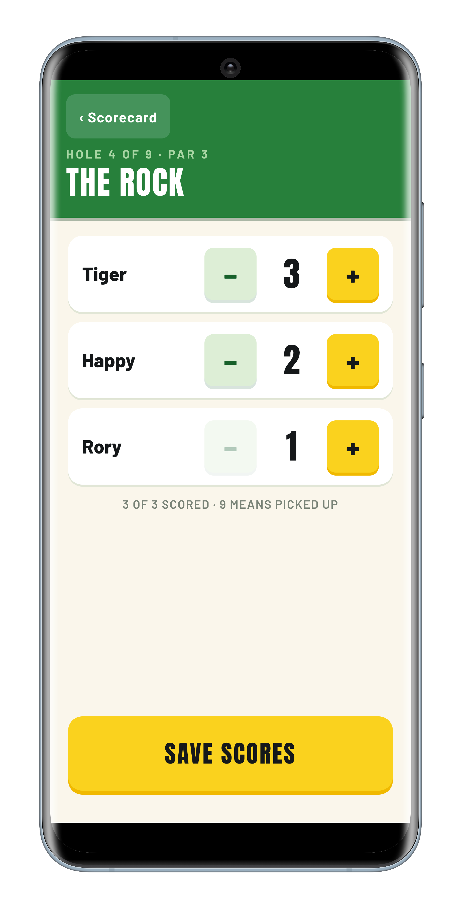
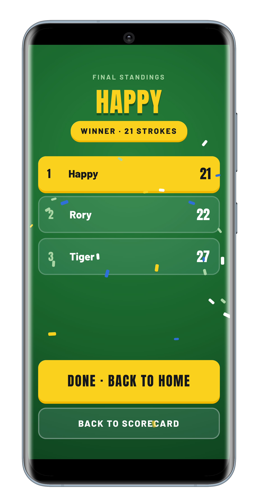
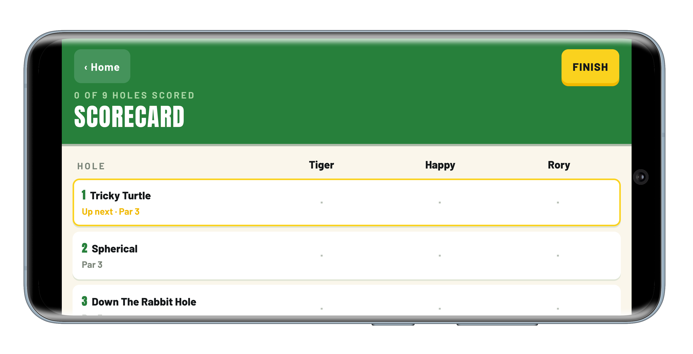

# Harbor Nine

A mini-golf scorecard web app for keeping score across a fixed 9-hole course.

**▶ Live demo: [btputput.app](https://btputput.app)**

<p align="center">
  
  &nbsp;
  
</p>
<p align="center">
  
</p>

## What it does

One person acts as scorekeeper and enters every player's score as the group
plays through the course.

- Set a fixed roster of players at the start of a **round**.
- Tap any of the 9 holes to enter each player's score (1–9; a 9 means "picked up").
- See every player's scores and running **totals** on a single read-only scorecard.
- Lowest total wins once all players are scored on all holes; ties yield
  co-winners with no tiebreaker.
- Edit the shared hole configuration (names + pars) once and it applies for
  everyone. Editing is gated behind a PIN.

No login, no accounts. The active round lives in your browser; the course
configuration is shared across all visitors.

## Tech stack

- **Frontend:** React 19 (with the React Compiler) + TypeScript, built with Vite
- **Routing:** React Router 7
- **Styling:** native CSS + CSS Modules (no UI library)
- **Testing:** Vitest + Testing Library (jsdom)
- **Backend:** Netlify Functions + Netlify Blobs
- **Hosting:** Netlify, served behind Cloudflare DNS/CDN

## Architecture & decisions

The interesting decisions in this project are written down rather than implied.

### Documented decisions (ADRs)

Each significant trade-off is captured as an
[Architecture Decision Record](docs/adr/):

- **[ADR-0001](docs/adr/0001-localstorage-only-persistence.md)** persists the
  active round to `localStorage` only: no backend, no accounts, no round
  history. Screens re-read from storage on render, so a refresh just works.
- **[ADR-0002](docs/adr/0002-styling-stack-native-css-modules.md)** uses native
  CSS + CSS Modules, deliberately choosing no headless/UI component library and
  native form controls.
- **[ADR-0003](docs/adr/0003-shared-hole-config-netlify-blobs.md)** shares the
  hole configuration across all users via Netlify Blobs, with PIN-gated writes
  and edge-cached reads.

### A real serverless backend

The shared course configuration is read and written through a Netlify Function
backed by Netlify Blobs (`GET`/`PUT /api/holes`). Writes are gated by a
server-side PIN (read from `process.env`, never shipped to the browser), and
reads are edge-cached so the common path is cheap. See
[docs/deployment.md](docs/deployment.md) for the full topology (Cloudflare →
Netlify → Blobs).

### Tested throughout

The suite uses Vitest + Testing Library with tests colocated next to their
source as `*.test.ts(x)`. Tests target user-visible behavior rather than
internal structure, and the domain logic (`src/round/utils/`) is covered by fast
unit tests. The project follows a commit-at-green workflow, so each commit is a
passing state.

The domain language is defined up front in [CONTEXT.md](CONTEXT.md), a glossary
of the ubiquitous terms (Round, Scorecard, Hole Entry, Player, Score, Total,
Winner) that the code and UI are named after.

## Running locally

Requires [pnpm](https://pnpm.io/).

```bash
pnpm install
pnpm dev     # start the app at http://localhost:5173
pnpm test    # run the test suite
```

`pnpm dev` runs the frontend only; the `/api/holes` Function falls back to the
default course config. To exercise the real backend (Netlify Functions + Blobs)
locally, see [docs/deployment.md](docs/deployment.md).

## License

[MIT](LICENSE)
